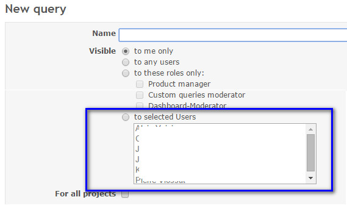
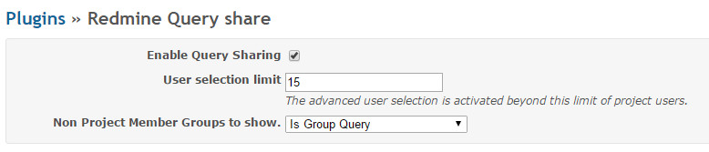
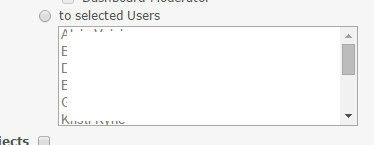
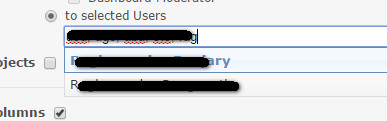
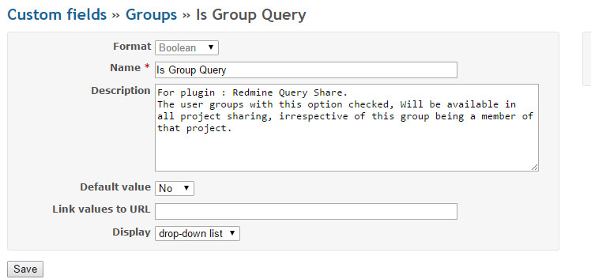

Redmine "Custom Query Share" Plugin
=======================

The Plugins aims at providing some user specific customization in redmine.

* Custom Query can be Private, Shared with users with specific Roles or Public,
The plugin provide another option "to selected users",
This allows selections of Project member users and groups and the query will be
accessible only for these members.

The plugin settings :

* Settings :

> Enable Query Sharing

>> Enables this plugin.

> User Selection Limit

>> The selection of users in the combo list is difficult when there are huge number
of users in the project. To give advanced flexibility to the users the limit is provided.
If the project members are within this range a default combo list will be shown.

>> 

>> If the project members are beyond this limit a text field is shown,

>> 

> Non Project group to show

>> By default the project member groups and members are shown, This option allow the
User groups flagged with a boolean custom field to be included automatically in all the projects.

>> 

>> Select this custom field option in the plugin settings. All the user groups defined
with this option checked will automatically included in all the projects.

Tested as compatible with Redmine v3.4.x